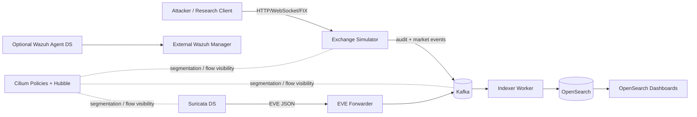

# exchange-honeynet

A Kubernetes-first, open-source deception lab for **exchange / market-data simulation**.

This repository scaffolds a lab that combines:

- **exchange simulator**: REST + WebSocket + FIX mock
- **Kafka on Kubernetes** via **Strimzi**
- **Suricata** for north-south / east-west traffic inspection
- **OpenSearch + OpenSearch Dashboards** for storage and analysis
- **Cilium** network policy examples for segmentation
- **optional Wazuh agent integration** for endpoint / workload telemetry forwarding to an external Wazuh plane

> Scope: this repo is a practical starter, not a production trading engine.
> It is intended for deception engineering, telemetry collection, SOC workflows, and research labs.

## Architecture



## Repository layout

```text
apps/
  exchange-simulator/    FastAPI + WebSocket + FIX mock server
  eve-forwarder/         tails Suricata eve.json and publishes to Kafka
  indexer-worker/        consumes Kafka topics and bulk-indexes into OpenSearch
k8s/base/
  namespaces/            namespaces
  kafka/                 Strimzi Kafka CRs, topics, users
  exchange-simulator/    deployment + service (namespace `telemetry`, shares Kafka secrets)
  suricata/              daemonset + rules + sidecar (namespace `telemetry`)
  opensearch/            single-node dev deployment + dashboards
  network-policies/      Cilium policy examples
integrations/
  wazuh-agent/           optional DaemonSet for external Wazuh manager
scripts/
  bootstrap-kind.sh      local dev cluster bootstrap notes
  deploy.sh              apply manifests in a sensible order
```

## Quick start

### 1. Prerequisites

- Kubernetes cluster (kind / k3d / bare-metal / managed)
- Cilium installed as the CNI
- Strimzi operator installed
- `kubectl`, `docker`, and optionally `kind`

### 2. Build app images

```bash
export REGISTRY=ghcr.io/YOUR_ORG
export TAG=dev

docker build -t $REGISTRY/exchange-simulator:$TAG apps/exchange-simulator
docker build -t $REGISTRY/eve-forwarder:$TAG apps/eve-forwarder
docker build -t $REGISTRY/indexer-worker:$TAG apps/indexer-worker

docker push $REGISTRY/exchange-simulator:$TAG
docker push $REGISTRY/eve-forwarder:$TAG
docker push $REGISTRY/indexer-worker:$TAG
```

### 3. Point manifests at your registry

Manifests are built with **Kustomize**. Edit [`k8s/overlays/my-registry/kustomization.yaml`](k8s/overlays/my-registry/kustomization.yaml) and set each image `newName` / `newTag` (or a digest as `newTag`) to your registry. Alternatively:

```bash
cd k8s/overlays/my-registry
kustomize edit set image ghcr.io/example/exchange-simulator=ghcr.io/YOUR_ORG/exchange-simulator:dev
kustomize edit set image ghcr.io/example/eve-forwarder=ghcr.io/YOUR_ORG/eve-forwarder:dev
kustomize edit set image ghcr.io/example/indexer-worker=ghcr.io/YOUR_ORG/indexer-worker:dev
```

Use `OVERLAY=k8s/base` to apply the base only (same placeholder images).

Environment overlays now include:

- `k8s/overlays/kind`
- `k8s/overlays/dev`
- `k8s/overlays/prod`

Render checks:

```bash
kustomize build k8s/overlays/kind
kustomize build k8s/overlays/dev
kustomize build k8s/overlays/prod
```

### 4. Deploy

```bash
bash scripts/deploy.sh
```

Or choose an overlay:

```bash
OVERLAY=k8s/overlays/kind bash scripts/deploy.sh
OVERLAY=k8s/overlays/dev bash scripts/deploy.sh
OVERLAY=k8s/overlays/prod bash scripts/deploy.sh
```

### 5. Seed test traffic

```bash
kubectl -n telemetry port-forward svc/exchange-simulator 8080:8080
curl -X POST http://127.0.0.1:8080/api/v1/orders \
  -H 'content-type: application/json' \
  -d '{"symbol":"BTC-USD","side":"buy","price":62500.5,"quantity":0.2,"account_id":"ACCT-ALPHA"}'
```

### 6. WebSocket stream

```bash
wscat -c ws://127.0.0.1:8080/ws/market?symbol=BTC-USD
```

### 7. FIX mock

```bash
nc 127.0.0.1 9878
```

Then send a simple line-delimited pseudo-FIX message using `|` as a visual separator; the server normalizes it to SOH internally:

```text
8=FIX.4.4|35=A|49=CLIENT01|56=SIMEX|34=1|52=20260324-09:30:00.000|98=0|108=30|
```

## Massive deployment workflow

For repeated large-scale rollout, use the built-in task targets:

```bash
make test
make pre-commit
make deploy OVERLAY=k8s/overlays/dev
make smoke OVERLAY=k8s/overlays/dev
```

For kind-based integration:

```bash
make kind-up
make deploy OVERLAY=k8s/overlays/kind
make smoke OVERLAY=k8s/overlays/kind
```

## Massive deployment guide

For large-scale honeypot deployment (many pods, many tenants/regions), use this baseline pattern:

### 1) Namespace-per-tenant or namespace-per-region

- Create one overlay per tenant/region (for example `k8s/overlays/tenant-a`, `k8s/overlays/apac`).
- Keep shared stateful components in `telemetry` (Kafka / OpenSearch), and isolate simulator policy by namespace where possible.

### 2) Scale simulator with Deployment replicas and HPA

Use static replicas for predictable load, then add HPA for burst traffic:

```bash
kubectl -n telemetry scale deploy/exchange-simulator --replicas=50
```

Example HPA:

```yaml
apiVersion: autoscaling/v2
kind: HorizontalPodAutoscaler
metadata:
  name: exchange-simulator
  namespace: telemetry
spec:
  scaleTargetRef:
    apiVersion: apps/v1
    kind: Deployment
    name: exchange-simulator
  minReplicas: 10
  maxReplicas: 200
  metrics:
    - type: Resource
      resource:
        name: cpu
        target:
          type: Utilization
          averageUtilization: 70
```

### 3) Tune rolling updates for safe mass rollout

For high replica counts, set conservative rollout windows:

- `maxUnavailable: 5%`
- `maxSurge: 10%`
- monitor with `kubectl -n telemetry rollout status deploy/exchange-simulator`
- rollback with `kubectl -n telemetry rollout undo deploy/exchange-simulator`

### 4) Multi-tenant policy and traffic control

- Keep default deny + explicit allowlists with Cilium.
- Limit simulator egress to Kafka/DNS only.
- Use per-tenant labels and separate `CiliumNetworkPolicy` objects.

### 5) Capacity split: stateless vs stateful

- `exchange-simulator`: stateless, horizontal scale (many replicas).
- `suricata`: DaemonSet per node (not HPA-driven).
- `kafka` and `opensearch`: stateful capacity planning first (CPU/memory/storage/IOPS), then replica tuning.

### 6) Operations checklist before scaling to hundreds of pods

- enable cluster-autoscaler on node groups
- define `requests/limits` for every workload
- add PodDisruptionBudget and anti-affinity for critical services
- watch Kafka lag, OpenSearch indexing pressure, and Cilium flow drops
- prefer image digest pinning for repeatable rollouts

## Threat emulation ideas

- unauthenticated market data scraping
- abusive symbol enumeration
- malformed REST payloads
- abnormal WebSocket connection churn
- FIX logon storms / malformed messages / replay attempts
- order placement floods from a single account / IP

## Wazuh note

This repo treats **Wazuh as an optional external security plane**. A full Wazuh central deployment already includes a **Wazuh server, Wazuh indexer, and Wazuh dashboard**; if you also run OpenSearch for this lab, co-locating both full stacks in one tiny cluster adds unnecessary overlap. Use the provided Wazuh agent DaemonSet to forward host/workload telemetry to an external Wazuh manager. For when to add an in-cluster full Wazuh stack, see [docs/wazuh-central-decision.md](docs/wazuh-central-decision.md).

## Hardening path

- replace single-node OpenSearch with a proper multi-node topology
- use Gateway API instead of legacy Ingress where needed
- add TLS for simulator / Dashboards **ingress** (in-cluster Kafka and OpenSearch already use TLS in base manifests)
- add HPA / PDB / anti-affinity
- extend Suricata / app detections beyond the starter rules (CI validates rules via `.github/workflows/suricata-rules.yml`)
- tighten egress further (default deny per namespace) once all allowlists are proven in your environment

## Phase 1 security baseline

Current baseline applied in manifests:

- Namespace Pod Security Admission labels:
  - `exchange-sim` and `security`: `enforce/audit/warn=restricted`
  - `telemetry`: `enforce=baseline`, `audit/warn=restricted` (keeps current Suricata/OpenSearch lab setup running while showing restricted-policy drift)
- App workloads (`exchange-simulator`, `indexer-worker`, `eve-forwarder`, `opensearch-dashboards`) include:
  - `runAsNonRoot: true`
  - `readOnlyRootFilesystem: true`
  - `allowPrivilegeEscalation: false`
  - `capabilities.drop: ["ALL"]`
  - `seccompProfile: RuntimeDefault`
  - writable `/tmp` via `emptyDir`

## Phase 2 operations baseline

This repo now includes the Phase 2 operational baseline:

- Hubble flow debugging runbook: [`docs/flow-debug.md`](docs/flow-debug.md)
- Quick flow command helper: [`scripts/hubble-check.sh`](scripts/hubble-check.sh)
- Make target: `make hubble-check`
- Dependabot automation: [`.github/dependabot.yml`](.github/dependabot.yml)
- CI rendered policy snapshot artifact:
  - `rendered-manifests-and-policies` (full rendered overlays + extracted policy snapshots)
- CI smoke-failure diagnostics artifact:
  - `smoke-failure-diagnostics` (pods/events/policies + Cilium/Hubble logs and status when smoke fails)

Recommended sequence:

```bash
make smoke OVERLAY=k8s/overlays/kind
make hubble-check
```

## License

MIT
